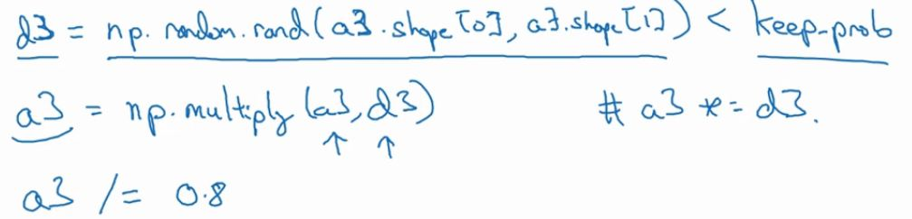
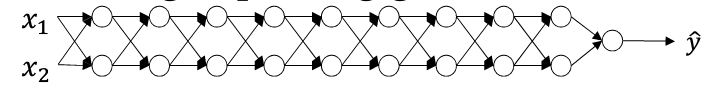

在训练神经网络时，我们需要做出很多决策。
例如神经网络的层数，含多少个隐藏单元，学习率的值，各层激活函数的选择，一开始不可能预测出这些参数的准确信息。
实际上，应用型机器学习是一个高度迭代的过程。
<!--more-->
# 偏差和方差 

关于深度学习的误差问题，趋势上是分别考虑偏差和方差，越来越少谈及偏差和方差的权衡问题。

假设这是数据集，如果拟合一条直线，可能得到一个Logistic回归拟合，如左图，但它并不能很好的拟合该数据集，这种情况偏差较高，称之为“欠拟合”。相反，如果我们拟合一个非常复杂的分类器，比如神经网络，或许非常适合这个数据集，如有图，但看起也不是一种好的拟合方式，分类器方差较高，数据过度拟合。在两者间，或许还有一些如中间这样，复杂度适中，数据拟合适度的分类器，称之为“适度拟合”。

如此这样只有x1和x2两个特征的二维数据集中，我们可以将偏差和方差可视化。但在多维数据集中，绘制数据和可视化分割边界无法实现，但我们能通过几个指标，来研究偏差和方差。

沿用猫图分类的例子，理解偏差和方差的两个关键数据是训练集误差和验证集误差。基于人眼辨别的错误率接近0%为基准：  
假定训练集错误率是1%，验证集错误率是11%，可以看出，训练集设置的很好，而验证集设置相对较差，这种情况，称之为“高方差”。  
假定训练集错误率是15%，验证集错误率是16%，算法并没有在训练集中得到很好的训练，这种情况称之为“高偏差”。  
假定训练集错误率是15%，验证集错误率是30%，这种情况下，算法偏差高，方差也很高。  
假定训练集错误率是0.5%，验证集错误率是1%，这种情况偏差和方差都很低。  

# 训练神经网络的基本方法

在初始模型完成后，首先检查算法的偏差情况，如果偏差高，则试着评估训练集的性能。如果偏差非常高，甚至无法拟合训练集，那将要选择一个新的网络，比如增加更多隐层、花费更多训练时间、采用更先进的优化算法等。

一旦偏差降低到可接受范围，检查方差的情况，为了评估方差，需要查看验证集性能。如果方差高，最好的解决方案就是采用更多的数据，但有时无法获得更多数据时，也可以尝试正则化来减少过拟合。

在机器学习初期阶段，关于所谓的偏差方差权衡的讨论屡见不鲜，因为，我们有很多方法，可以增加偏差、减少方差，也可以减少偏差、减少方差。
但深度学习的早期阶段，我们没有太多工具可以做到只减少偏差或只减少方差，却不影响到另外一方。
而现如今在深度学习和大数据时代，我们有工具可以做到在减少偏差的同时，不对另一方产生过多不良影响。
这就是深度学习对监督学习大有裨益的一个重要原因，也是我们不用太过于关注如何平衡偏差和方差的一个重要原因。

总之，就是不断重复尝试，直到找到一个低偏差，低方差的框架，我们就会得到一个非常规范化的网络。

# 正则化

神经网络过度拟合数据，就会存在高方差的问题，那么最先想到的解决方法可能就是正则化。
另一个解决方法是准备更多的数据，这也是很可行的方法。

### L2正则化
以Logistic回归为例，在逻辑回归函数中加入正则化，添加正则化参数$\lambda$，该参数常用验证集来配置。
$J(w,b)=\frac{1}{m} \sum_{i=1}^m l(\hat{y}^{(i)},y^{(i)})+\frac{\lambda}{2m}\|\|w\|\|_2^2$

此方法称L2正则化，是最常见的正则化类型。因为w通常是一个高维参数矢量，已经可以表达高偏差问题，而b仅是一个实数，所以b常忽略不计。

以神经网络为例，实现正则化，成本函数包含$w^{[1]},b^{[1]}$到$w^{[L]},b^{[L]}$所有参数
$J(w^{[1]},b^{[1]}…w^{[L]},b^{[L]})$  
$=\frac{1}{m} \sum_{i=1}^m l(\hat{y}^{(i)},y^{(i)})$        
   
$+\frac{\lambda}{2m} \sum_{L=1}^L \|\|W^{[L]}\|\|_F^2$
  
该矩阵范数被称为“弗罗贝尼乌斯范数”，用下标F表示，它表示一个矩阵中所有元素的平方和。

在弗罗贝尼乌斯范数中，假设正则化$\lambda$设置的足够大，那么权重矩阵$W^{[L]}$将会非常接近于0，即大大减少了隐藏单元的影响，将使神经网络变得很小，但深度很大，它会使网络从过拟合状态变为高偏差状态，但由于有$\lambda$的存在，于是网络会接近于中间状态。

### dropout正则化

将神经网络复制到右侧，dropout正则化会遍历网络中每一层的每个节点，并在每一个节点上设置消除神节点的概率，假设网络中的每一节点都以抛硬币的方式设置概率，那么每一节点的被保留和被消除的概率都是0.5，设置完节点概率后，我们随机消除掉一些节点，并且删除该节点上的连线，最后我们将得到一个节点更少，规模更小的网络，之后对这个简化后的网络进行训练即可。

实施dropout的结果是它会压缩权重，并完成一些预防过拟合的外层正则化。

在测试阶段不适用dropout，因为在测试阶段预测时应用dropout函数，预测会受到干扰。

#### inverted dropout
以一个三层网络为例：

首先定义向量$d^3$，表示一个三层的dropout向量，每个样本和每个隐藏单元在$d^3$中对应的值为1的概率都是keep-prob的值，设为0.8。
之后从第三层中获取激活函数$a^3$，等于上面的$a^3$乘以$d^3$，其为元素相乘。作用是过滤$d^3$中所有等于0的元素。
最后我们向外扩展$a^3$，用它除以0.8或keep-prob的值。

它的功能是，不论keep-prob的值是多少，都可以确保$a^3$的期望值不变。

### 其他正则化方法

除了L2正则化、dropout正则化，还有几种方法可以减少神经网络的过拟合。
#### 数据扩增
比如以图片作为训练集，通过水平翻转图片(当然也可以进行截取),以扩充训练集，使训练集可以增大一倍，因为训练集有冗余，所以效果不如额外手机一组新图片那么好，但节省了获取图片的花费。
以这种方式，可以扩增算法数据，进而正则化数据集，减少过拟合。

#### early stoping
还有一种方法叫early stopping

运行梯度下降时，我们可以画出成本函数J的训练趋势，还可以绘制出验证集误差，它可以是验证集上的分类误差，如图，验证集误差通常会先呈下降趋势，然后在某个节点处开始上升。

在训练初期，w值相对很小，所以在长期训练神经网络的过程中，w的值会越变越大，early stopping的作用就是在中间点停止迭代过程，我们将得到一个w值中等大小的弗罗贝尼乌斯范数。

该方法的主要缺点是，在机器学习过程中，不能独立的处理优化成本函数J和正则化这两个问题。

# 梯度消失(梯度爆炸)
在训练深度网络时，导数或坡度有时会变得非常大，或非常小，这加大了训练的难度。

假设正在训练这样一个极深的神经网络，为了简化，令b为0，且使用线性激活函数g(z)=z
那么输出$\hat{y}=w^{[L]}w^{[L-1]}w^{[L-2]}…w^{[1]}x，（w^{[1]}x=z^{[1]}=a^{[1]}）$

通过推理，假设每个矩阵都大于或小于1，哪怕仅大一点点，或小一点点，激活函数将以指数级增长或递减，$\hat{y}$的值将会变得极大或极小，从而导致训练难度上升。
尤其当梯度下降步长较小时，将会花费很长时间来学习。 
#### 权重初始化
针对该问题，有一不完整的解决方案，虽不能彻底解决问题，却很有用。
有助于我们为神经网络更谨慎的选择随机初始化参数。

当只有一个神经元时，有若干输入特征向量,
则z为若干个$w_ix_i$之和，此处令b=0暂且忽略
    
为了防止预测z值过大或过小，可以看到当n越大时，希望$w_{[i]}$越小，
最合理的方法就是设置$Var(W_i)$=1/n，n表示神经元的输入特征数量  
实际上要做的就是设置某层权重矩阵W，

$W^{[L]}=np.random.randn(shape)*np.sqrt(\frac{1}{n^{[L-1]}})$

如果使用的是Relu激活函数，而不是1/n，方差$Var(W_i)$设置为2/n效果更好
初始化时，尤其使用Relu激活函数时，它取决于你对随机变量的熟悉程度

因为它给权重矩阵W设置了合理值，不能比1大很多，也不能比1小很多，所以梯度没有爆炸或消失过快，它确实降低了坡度消失和爆炸问题。

# 梯度检验

在实施backprop时，有一个测试叫做梯度检验，为了确保backprop正确实施，为了实现梯度检验，首先谈谈如何对计算梯度做数值逼近

### 数值逼近

函数标记为$f(\theta)$，$f=(\theta)=\theta ^3$
假设$\theta=1$，不增大$\theta$的值，而是在$\theta$右侧设置一个$\theta +\varepsilon$，在左侧设置一个$\theta -\varepsilon$，
如图，大三角形的高宽比值更接近于$\theta$的导数，将右上角的三角形下移，这个大三角形同时考虑了这两个小三角形

所以我们得到的不是一个单边公差而是一个双边公差，
故高宽比值为:$\frac{f(\theta +\varepsilon)-f(\theta -\varepsilon)}{2\varepsilon}$，它的期望值接近$g(\theta)$

### 梯度检验
假设网络中含有$W^{[1]},b^{[1]},…,W^{[L]},b^{[L]}$，为了执行梯度检验，首先将所有参数转换成一个巨大的向量数据，得到巨型向量$\theta$，得到成本函数$J(\theta)$

接着得到W和b顺序相同的$dW^{[1]},db^{[1]},…,dW^{[L]},db^{[L]}$数据，用他们来初始化大项量$d\theta$，它与$\theta$具有相同维度，经过相同的转换和连接运算操作后，可将所有导数转换成一个大向量$d\theta$

J是一个超级参数$\theta$的函数，
为了实施梯度检验，需要循环执行：
$d\theta _{approx}^{[i]}=\frac{J(\theta _1,\theta _2,…,\theta _i+\varepsilon,…)-J(\theta _1,\theta _2,…,\theta _i-\varepsilon,…)}{2\varepsilon}$

这个值应该逼近$d\theta ^{[i]}$
需要对每个i的每个值都执行这个运算，最后得到两个向量，
$d\theta$和其逼近值$d\theta _{approx}$，它与$d\theta$维度相同
需要验证的就是这些向量是否彼此接近

判断向量是否接近时，通常：
计算两个向量的距离，$\|\| d\theta _{approx}-d\theta \|\| _2$，  

之后用向量长度做归一化
分母只是预防向量太大或太小，使这个方程变成比率

如果计算方程得到的值为$10^{-7}$或更小，则意味着导数逼近很可能是正确的。
如果值在$10^{-5}$范围内，就需要注意是否某个值过大。
如果值在$10^{-3}$范围内，就需要注意是否存在bug。

### 注意事项

首先，不要在训练中使用梯度检验，它只是用于调试
第二，如果算法的梯度检验失败，要检查所有项，试着找出bug
第三，在实施梯度检验时，如果使用正则化，请注意正则化
第四，梯度检验不能与dropout同时使用
第五，在随机初始化过程中，先运行梯度检验，然后再训练网络